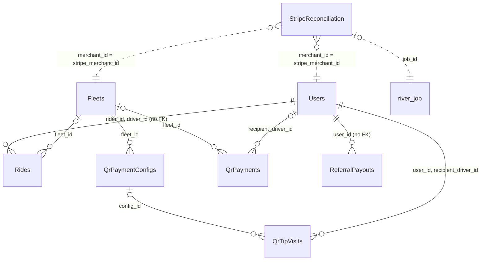

Yelo charges riders with Stripe direct charges on a connected account and keeps only references and outcomes in Postgres. There is no ledger table. Most payment state lives in columns on `Rides`, `Users`, `Fleets`, and `DriverApplications`, plus a few dedicated tables. For product context see [Payments and payouts](/concepts/payments-and-payouts).

Dotted lines are matched by value, not by foreign key.

## Stripe identifiers

| Location | Column | Stripe object | Notes |
| --- | --- | --- | --- |
| `Users` | `stripe_customer_id` | Customer on the platform account | `''` until `ensureStripeCustomerSetup` creates the customer during payment setup. |
| `Users` | `stripe_merchant_id` | Express connected account for a driver | `''` when the driver has no account. |
| `Fleets` | `stripe_merchant_id` | Express connected account for a fleet | `NULL` when none. Used only when `has_custom_payouts` is true. |
| `Fleets` | `stripe_status` | Account onboarding status | Default `'not_required'`. Set to `pending`, `restricted`, or `complete` by `account.updated` handling. |
| `Fleets` | `stripe_onboarding_url` | Account link URL | Onboarding link for fleet owners. |
| `Rides` | `payment_method_id` | PaymentMethod on the platform customer | Chosen at confirm. |
| `Rides` | `cloned_payment_method_id` | PaymentMethod cloned onto the connected account | Required for direct charges. |
| `Rides` | `payment_intent_id` | PaymentIntent on the connected account | Fare authorization. |
| `Rides` | `tip_payment_intent_id` | PaymentIntent on the connected account | Separate tip charge. |
| `Rides` | `stripe_merchant_id` | Connected account that owns the PaymentIntent | Needed to call Stripe with `Stripe-Account`. |
| `QrPaymentConfigs` | `stripe_product_id`, `stripe_price_id`, `stripe_payment_link_id` | Product, Price, Payment Link on the fleet's account | |
| `QrPayments` | `stripe_session_id`, `stripe_payment_intent_id`, `stripe_account_id` | Checkout Session, PaymentIntent, connected account | |

The fleet and user tables are documented on [Users and identity](/reference/database/users-and-identity) and the fleets pages linked from the [table index](/reference/database/overview#table-index).

## Ride payment columns

These columns live on [`Rides`](/reference/database/rides#pricing-and-payment).

| Column | Type | Units | Meaning |
| --- | --- | --- | --- |
| `price` | `real` | Dollars | Fare for the selected option. |
| `discounted_price` | `real` | Dollars | Fare after discount. The charged fare is `COALESCE(discounted_price, price)`. |
| `is_discounted`, `discount_id` | `boolean`, `uuid` | | Whether a discount applied, and which `Discounts` row. |
| `payment_method_id`, `payment_method_brand` | `text` | | Rider's payment method and its display brand, such as `visa` or `Apple Pay`. |
| `rider_ip_address`, `rider_user_agent`, `payment_consent_at` | `text`, `text`, `timestamptz` | | Online mandate data sent with the off-session PaymentIntent. `payment_consent_at` keeps the first confirm time across requeues. |
| `payment_intent_id`, `payment_intent_client_secret` | `text` | | Fare PaymentIntent and its client secret. |
| `payment_ephemeral_key` | `text` | | Legacy. `NOT NULL DEFAULT ''`. |
| `pre_auth_amount` | `numeric(10,2)` | Dollars | Amount authorized. Fare plus `models.TipBuffer` ($5) when tips are on, otherwise the fare. |
| `cloned_payment_method_id`, `stripe_merchant_id` | `text` | | Payment method on, and ID of, the connected account charged. |
| `driver_payout` | `real` | Dollars | Driver earnings for the ride: fare at completion, plus tip, or the cancellation fee on a cancelled ride. |
| `tips_enabled` | `boolean` | | Whether the rider can tip. Set at request. |
| `tip_amount` | `numeric(10,2)` | Dollars | Tip charged. `0` means no tip. |
| `tip_window_expires_at` | `timestamptz` | | End of the tip window, 24 hours after completion. |
| `tip_payment_intent_id` | `text` | | Separate tip PaymentIntent when the tip is larger than the buffer or the fare was already captured. |
| `stripe_fee_cents` | `bigint` | Cents | Stripe processing fee from the connected account's balance transactions. |
| `stripe_fee_repair_after` | `timestamptz` | | Backoff before the fee repair job tries this ride again. |

### Charge flow

1. **Confirm.** `ConfirmRequestedRide` stores the price, `payment_method_id`, brand, IP, user agent, and `payment_consent_at`. Nothing is charged.
2. **Accept.** `processRidePayment` in `internal/service/ride/driver.go` picks the merchant: the fleet's account when `Fleets.has_custom_payouts` is true and it has a `stripe_merchant_id`, otherwise the driver's `Users.stripe_merchant_id`. It clones the rider's payment method onto that account and creates a PaymentIntent there with `capture_method = manual`, `confirm = true`, and `off_session = true`. `AddPaymentIntent` stores `payment_intent_id`, `payment_intent_client_secret`, `pre_auth_amount`, `cloned_payment_method_id`, and `stripe_merchant_id`.
3. **Requeue.** When a driver cancels and the ride goes back to matching, `RequeueRideAfterDriverCancel` keeps `payment_intent_id` and the other payment columns. On the next accept, `reuseRideAuthorization` either reuses the existing hold or releases it before authorizing the new merchant. The unwired operation journal has its own `RequeueReservedRide` and `ClearReleasedRideAuthorization` queries that null the PaymentIntent columns instead.
4. **Complete.** Without tips, the fare is captured immediately and `CompleteRideForRating` stores `driver_payout`. With tips, capture is deferred and `tip_window_expires_at` is set.
5. **Tip or expiry.** A tip within the $5 buffer is captured on the same PaymentIntent as fare plus tip (`CompleteRideTip`). A larger tip captures the fare first, then charges a separate automatic-capture PaymentIntent and stores `tip_payment_intent_id`. `AutoCaptureTipWindowExpired` captures the fare alone for rides whose window passed.
6. **Webhook.** `payment_intent.succeeded` calls `PaymentService.PaymentSucceeded`, which runs `MarkRidePaymentSucceeded` to set `driver_payout` from `amount_received`. That query skips rides that have a `RideOperations` row.

No application fee is set on the PaymentIntent. Yelo's revenue is not stored in these tables.

### Stripe fee repair

`stripe_fee_cents` is filled from each connected account's balance transactions by the `stripe_drive_fee_scan` and `stripe_drive_fee_repair` River jobs in `internal/service/user/drive_fee_jobs.go`. `PersistStripeFees` writes fees by `payment_intent_id`. When fees can't be resolved, `DeferMissingStripeFeeRepair` sets `stripe_fee_repair_after` 24 hours ahead. Partial indexes `rides_missing_fee_driver_idx` and `rides_missing_fee_payment_intent_idx` keep these scans cheap.

### Driver payouts

Stripe payouts to drivers aren't stored in Postgres. `internal/service/earnings` reads balances and payouts from Stripe on demand and creates payouts with an idempotency key. The only payout table is the manual [`ReferralPayouts`](#referralpayouts) ledger.

## StripeReconciliation

One row per connected account, tracking when Yelo last replayed that account's state from Stripe. Created in `000304_stripe_reconciliation`. Reconciliation fetches the Express account and runs the same `AccountUpdated` handler as the `account.updated` webhook. This repairs `Fleets.stripe_status` and `DriverApplications.stripe_status` when a webhook was missed.

| Column | Type | Null | Default | Meaning |
| --- | --- | --- | --- | --- |
| `merchant_id` | `text` | No | | Primary key. A connected account ID from `Users` or `Fleets`. |
| `next_due_at` | `timestamptz` | No | `now()` | When the account is next eligible. 24 hours after success or failure, 7 days after `stripe_account_invalid`. |
| `discovered_at` | `timestamptz` | No | `now()` | When discovery first inserted the account. |
| `last_succeeded_at` | `timestamptz` | Yes | | Last successful reconciliation. |
| `last_attempted_at` | `timestamptz` | Yes | | Last attempt with a recorded outcome. |
| `job_id` | `bigint` | Yes | | `river_job.id` of the in-flight `stripe_reconcile_account` job. `NULL` when idle. No foreign key. |
| `status` | `text` | No | `'due'` | `due`, `pending`, `succeeded`, `failed`, or `ineligible`. |
| `error_category` | `text` | No | `''` | Why the last attempt failed: `stripe_account_invalid`, `no_eligible_owner`, or `job_exhausted_or_missing`. Empty after success. |

Index `stripe_reconciliation_due (next_due_at, merchant_id)` where `job_id IS NULL`.

### Lifecycle

The `stripe_reconciliation_dispatch` worker in `internal/service/payment/reconciliation_jobs.go`:

1. Runs `DiscoverStripeReconciliationAccounts`, which inserts every non-empty `stripe_merchant_id` from non-deleted `Users` and `Fleets`.
2. Marks rows `failed` with `job_exhausted_or_missing` when their linked job is no longer live in `river_job`.
3. Exits early while `StripeReconciliationControl.cooldown_until` is in the future.
4. Claims up to 100 due rows with `FOR UPDATE SKIP LOCKED`, inserts a unique `stripe_reconcile_account` job for each, and sets `job_id` and `status = 'pending'` in the same transaction.
5. Logs coverage counts. Warnings are rate limited to once an hour.

The `stripe_reconcile_account` worker exits if `job_id` no longer matches. It snoozes during a cooldown and marks the row `ineligible` when no live user or fleet owns the account. A Stripe 400 or 404 marks it `failed` with `stripe_account_invalid`. A 401, 403, or 429 sets a global cooldown. Success sets `succeeded`, clears `job_id`, and schedules the next run 24 hours out. Every write is guarded by `job_id`, so a stale job can't overwrite a newer outcome.

## StripeReconciliationControl

Singleton row holding the global Stripe cooldown. Created in `000304_stripe_reconciliation`.

| Column | Type | Null | Default | Meaning |
| --- | --- | --- | --- | --- |
| `id` | `boolean` | No | `true` | Primary key. `CHECK (id)` allows only `true`, so the table has at most one row. |
| `cooldown_until` | `timestamptz` | No | `now()` | No reconciliation calls before this time. `SetStripeReconciliationCooldown` only moves it forward with `GREATEST`. |

The cooldown is at least 1 minute for 429 and 15 minutes for 401 and 403, extended by Stripe's `Retry-After` header.

## QrPaymentConfigs

A fleet's QR-code payment page: a Stripe Product, Price, and Payment Link on the fleet's connected account, plus an optional Dub short link. Created in `000204_qr_payment_configs`. Managed from the dashboard through `internal/service/qrpayment`. See [QR payments](/dashboard/qr-payments).

| Column | Type | Null | Default | Meaning |
| --- | --- | --- | --- | --- |
| `id` | `uuid` | No | `gen_random_uuid()` | Primary key. |
| `fleet_id` | `uuid` | No | | FK to `Fleets`. The fleet must have a `stripe_merchant_id`. |
| `slug` | `text` | No | | Public URL slug. Unique. Check: not empty. The service requires `^[a-z0-9][a-z0-9-]*$`. |
| `product_name` | `text` | No | | Stripe product name shown at checkout. |
| `pricing_mode` | `text` | No | | `fixed` or `custom`. |
| `fixed_amount` | `bigint` | Yes | | Price in cents for `fixed` mode. |
| `custom_min`, `custom_max`, `custom_preset` | `bigint` | Yes | | Bounds and suggested amount in cents for `custom` mode. |
| `stripe_product_id`, `stripe_price_id` | `text` | No | | Stripe product and current price. Editing pricing creates a new price. |
| `stripe_payment_link_id`, `stripe_payment_link_url` | `text` | No | | Stripe payment link. |
| `dub_link_id`, `dub_short_url` | `text` | No | `''` | Dub short link. Empty when Dub creation failed; the config is still saved. |
| `is_active` | `boolean` | No | `true` | Deactivated configs stay in the table. `GetActiveQrPaymentConfigBySlug` only returns active ones. |
| `created_at`, `updated_at` | `timestamptz` | No | `now()` | |

`UpdateQrPaymentConfig` and `DeactivateQrPaymentConfig` only change a row whose `stripe_payment_link_id` still matches the one the caller read, so concurrent repricing and deactivation can't hide an active link. `UpdateQrPaymentConfig` also requires an active config on an active, unarchived fleet. The Stripe link is deactivated before the row. A Stripe failure, or a missing account reference, blocks the local deactivation. Trigger `guard_fleet_qr_archive` rejects an active config, or a new payment link, on an archived fleet. An active config blocks archiving its fleet.

## QrPayments

One row per completed Stripe Checkout Session from a QR payment or driver tip page. Created in `000203_qr_payments`. `PaymentService.CheckoutSessionCompleted` inserts it from the `checkout.session.completed` webhook.

| Column | Type | Null | Default | Meaning |
| --- | --- | --- | --- | --- |
| `id` | `uuid` | No | `gen_random_uuid()` | Primary key. |
| `stripe_session_id` | `text` | No | | Checkout Session ID. Unique. `InsertQrPayment` uses `ON CONFLICT DO NOTHING`, so webhook retries are idempotent. |
| `stripe_payment_intent_id` | `text` | Yes | | PaymentIntent created by the session. |
| `stripe_account_id` | `text` | No | | Connected account from the webhook event. |
| `amount_total` | `bigint` | No | | Amount in cents. |
| `currency` | `text` | No | `'usd'` | |
| `payment_status` | `text` | No | | Stripe's session `payment_status`, such as `paid`. |
| `customer_name`, `customer_email`, `customer_phone` | `text` | Yes | | From session customer details, falling back to session metadata for name and phone. |
| `payment_method_type` | `text` | Yes | | First entry of the session's `payment_method_types`. |
| `card_brand`, `card_last4`, `wallet_type` | `text` | Yes | | Never populated. The webhook handler doesn't set them. |
| `metadata` | `jsonb` | No | `'{}'` | Full session metadata. |
| `stripe_created_at` | `timestamptz` | Yes | | Session creation time from Stripe. |
| `created_at` | `timestamptz` | No | `now()` | Insert time. The dashboard filters on this. |
| `fleet_id` | `uuid` | Yes | | FK to `Fleets`. From `metadata.fleet_id`, or the first fleet whose `stripe_merchant_id` matches the connected account. |
| `recipient_driver_id` | `uuid` | Yes | | Driver being tipped, from `metadata.recipient_driver_id`. FK to `Users` with `ON DELETE SET NULL`. |

Indexes on `created_at`, `fleet_id`, `stripe_account_id`, and `(recipient_driver_id, created_at DESC)`. Readers: `ListQrPayments` and `CountQrPayments` for the dashboard (scoped by fleet), and `analytics.sql`.

## QrTipVisits

Funnel of signed-in users who opened a tip page, and whether they started checkout. Created in `000236_qr_tip_visits`. Written by `internal/service/tipping`. The visit also sets `Users.acquisition_source` to `qr_payment` if it was still the default.

| Column | Type | Null | Default | Meaning |
| --- | --- | --- | --- | --- |
| `id` | `uuid` | No | `gen_random_uuid()` | Primary key. |
| `user_id` | `uuid` | No | | Visitor. FK to `Users` with `ON DELETE CASCADE`. |
| `config_id` | `uuid` | Yes | | Fleet QR config visited. FK to `QrPaymentConfigs` with `ON DELETE CASCADE`. `NULL` for a driver tip page. |
| `recipient_driver_id` | `uuid` | Yes | | Driver tip page visited. FK to `Users` with `ON DELETE CASCADE`. |
| `first_seen_at` | `timestamptz` | No | `now()` | First visit. |
| `last_seen_at` | `timestamptz` | No | `now()` | Most recent visit. Bumped on conflict. |
| `checkout_started_at` | `timestamptz` | Yes | | When the user last started checkout. |
| `stripe_checkout_session_id` | `text` | Yes | | Checkout Session created for this visit. Unique when set. |

Unique on `(user_id, config_id)` and, for driver pages, on `(user_id, recipient_driver_id)`. Driver tip pages use fixed limits in `internal/service/tipping/tipping.go`: minimum 100, maximum 50,000, preset 500, all in cents.

<Note>
Because `config_id` is nullable and Postgres treats nulls as distinct, the `(user_id, config_id)` constraint doesn't dedupe driver-page rows. The partial unique index on `(user_id, recipient_driver_id)` does.
</Note>

## PaymentIntents

Legacy table from `000017_add-payment-intent-table`.

| Column | Type | Null | Default | Meaning |
| --- | --- | --- | --- | --- |
| `id` | `uuid` | No | `gen_random_uuid()` | Row ID. Not declared as a primary key. |
| `payment_intent_id` | `text` | No | | Stripe PaymentIntent ID. Not unique, not indexed. |
| `client_secret` | `text` | No | | PaymentIntent client secret. |
| `ephemeral_key` | `text` | No | | Stripe ephemeral key. |
| `customer_id` | `text` | No | | Stripe customer. |
| `created_at` | `timestamptz` | No | `now()` | |
| `status` | `text` | No | | Stripe PaymentIntent status. |

`PaymentIntentRepository.Create` exists but nothing calls it. The payment webhooks still call `UpdateStatus`, which runs `UPDATE "PaymentIntents" ... WHERE payment_intent_id = $2` against a table no current code inserts into, so the update matches only historical rows and does a sequential scan.

## ReferralPayouts

Manual ledger of referral reward payments approved by an admin. Created in `000142_referral_values`. No Stripe object is involved. The referral dashboard routes in `internal/server/http/referral` call `AddPayout` and `UpdatePayout`.

| Column | Type | Null | Default | Meaning |
| --- | --- | --- | --- | --- |
| `payout_id` | `uuid` | No | `gen_random_uuid()` | Primary key. |
| `user_id` | `uuid` | No | | Referrer being paid. No foreign key. |
| `approver_id` | `uuid` | No | | Admin who recorded or last edited the payout. No foreign key. |
| `amount` | `double precision` | No | | Amount in dollars. |
| `timestamp` | `timestamptz` | No | | When the payout was recorded or last edited. |

The referral summary query in `referral.sql` subtracts `SUM(amount)` from rewards earned (from `ReferralRewards` values) to compute `total_outstanding`. The referral tables themselves are indexed on the [overview](/reference/database/overview#table-index).

## Gotchas

- Money types are mixed: `real` dollars (`Rides.price`, `discounted_price`, `driver_payout`), `numeric(10,2)` dollars (`tip_amount`, `pre_auth_amount`), `double precision` dollars (`ReferralPayouts.amount`), and `bigint` cents (`stripe_fee_cents`, all QR tables). Convert with `ROUND(x * 100)`, as the `ride_operation.sql` queries do.
- Several Go paths convert dollars to cents with `int(x * 100)`, which truncates. Because `price` is a `real`, a $19.99 fare becomes 1998 cents.
- `Rides.payment_intent_client_secret` and `PaymentIntents.client_secret` store Stripe client secrets in plain text.
- `StripeReconciliation.merchant_id` isn't a foreign key. An account disappears from eligibility when its user is soft deleted or its fleet gets a `deleted_at`, and the next run marks it `ineligible`.
