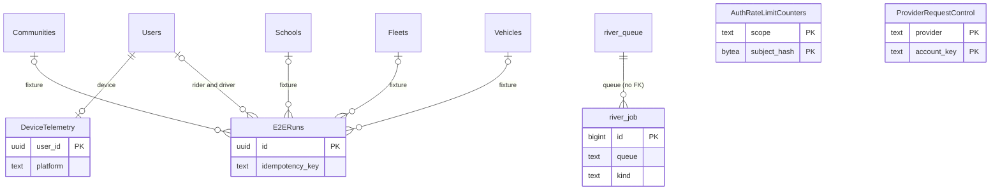

These tables support operations rather than a product feature: device and permission telemetry, cross-instance rate limiting, the River job queue, migration bookkeeping, E2E fixtures, and a few legacy tables. For pools, Redis, and the migration workflow, see [Data layer](/engineering/api/data-layer).

## DeviceTelemetry

The latest device snapshot per user, reported by the app.

| Column | Type | Null | Default | Meaning |
| --- | --- | --- | --- | --- |
| `user_id` | `uuid` | no | | Primary key. FK to `"Users"` `ON DELETE CASCADE`. One row per user, so a new device overwrites the old one. |
| `platform`, `os_version`, `device_model`, `device_manufacturer` | `text` | no | | Device facts. |
| `app_version`, `build_number` | `text` | no | | App binary. |
| `expo_update_id` | `text` | yes | | Expo OTA update running. |
| `screen_width`, `screen_height` | `integer` | no | `0` | Screen size. |
| `pixel_ratio` | `real` | no | `1.0` | Pixel density. |
| `locale` | `text` | no | `'en-US'` | Device locale. |
| `timezone` | `text` | no | `'UTC'` | Device timezone. |
| `notifications_enabled` | `boolean` | no | `false` | OS notification permission. |
| `location_permission` | `text` | no | `'undetermined'` | OS location permission. |
| `push_notification_token` | `text` | yes | | Deprecated shadow. `"Users".push_notification_token` is canonical. The column comment says to remove it after the rollout window. |
| `carrier` | `text` | yes | | Mobile carrier. |
| `total_memory_mb` | `integer` | yes | | Device memory. |
| `install_referrer` | `text` | yes | | Android install referrer. |
| `updated_at` | `timestamptz` | no | `now()` | Last report. |
| `contact_permission` | `text` | no | `'undetermined'` | OS contacts permission. An empty value in a report keeps the stored value. |
| `contact_access_privileges` | `text` | no | `''` | iOS limited or full access. Reset when the permission changes without a new value. |
| `contact_permission_updated_at` | `timestamptz` | yes | | Last permission change. |

**Triggers**

- `sync_legacy_telemetry_push_token_trigger` (`sync_legacy_telemetry_push_token()`): when a report carries a token, it clears that token from every other user and copies it to `"Users".push_notification_token` for this user. This keeps old app builds that send the token with telemetry working.
- `contact_sync_telemetry` (`enqueue_contact_activity()`): enqueues a contact sync when `updated_at` crosses a 5-minute bucket. See [Events, spots, and social graph](/reference/database/growth-events-and-social#contact-sync).

**Written by / read by.** `internal/service/telemetry` upserts through `UpsertDeviceTelemetryWithoutPushToken` (`queries/push_tokens.sql`). The push token queries clear the shadow column when a token moves. Read by `analytics.sql` (permission breakdowns), `user_profile.sql`, `user_driver.sql`, `driver_fleet_primitives.sql`, and `contact_profiles.sql`.

## AuthRateLimitCounters

Fixed-window counters for auth v3 rate limits, shared across instances.

| Column | Type | Null | Default | Meaning |
| --- | --- | --- | --- | --- |
| `scope` | `text` | no | | Limit name, such as `phone_send_phone`, `phone_send_requester`, `phone_verify_phone`, `phone_verify_requester`, or `http_` plus the route scope. CHECK `^[a-z][a-z0-9_]{0,63}$`. |
| `subject_hash` | `bytea` | no | | 32-byte hash of the limited subject (phone, requester). Raw identifiers are never stored. CHECK length 32. |
| `count` | `integer` | no | | Attempts in the window. CHECK positive. |
| `window_started_at` | `timestamptz` | no | | Window start. |
| `expires_at` | `timestamptz` | no | | Window end. CHECK after start. |
| `updated_at` | `timestamptz` | no | | Last reservation. |

- Primary key `(scope, subject_hash)`. Index `auth_rate_limit_counters_expiry_cleanup_idx` on `expires_at`.
- `ReserveAuthV3RateLimit` (`queries/authv3.sql`) is one atomic upsert. An expired window restarts at 1. Otherwise the count increments only while it is below `max_count`. No returned row means the caller is over the limit.
- `DeleteExpiredAuthV3RateLimitCounters` deletes expired rows in batches with `FOR UPDATE SKIP LOCKED`, called from `internal/data/repository/authv3.go` cleanup.
- Callers: `internal/service/authv3/phone_orchestration.go` and `internal/server/http/authv3/durable_rate_limiter.go`. Other auth tables are on [Users and identity](/reference/database/users-and-identity).

## ProviderRequestControl

A cross-instance request pacer for external providers. Today only Resend uses it.

| Column | Type | Null | Default | Meaning |
| --- | --- | --- | --- | --- |
| `provider` | `text` | no | | Provider. Only `resend` is written. |
| `account_key` | `text` | no | | Provider account. |
| `next_request_at` | `timestamptz` | no | `'-infinity'` | Earliest next request of any kind. |
| `next_background_at` | `timestamptz` | no | `'-infinity'` | Earliest next background request, so bulk work leaves room for interactive calls. |
| `cooldown_until` | `timestamptz` | no | `'-infinity'` | Backoff after a provider rate limit. |

Primary key `(provider, account_key)`. `internal/data/resend/gate.go` admits a call only when an `UPDATE` advances the row. Otherwise it reads the wait time and returns a synthetic 429 when the wait exceeds 15 seconds. Quo has its own equivalent, `"QuoRequestControl"` (see [Notifications and messaging](/reference/database/growth-notifications-and-messaging#quorequestcontrol)).

## KpiManualLog

Hand-entered KPI values that the database cannot compute.

| Column | Type | Null | Default | Meaning |
| --- | --- | --- | --- | --- |
| `id` | `uuid` | no | `gen_random_uuid()` | Primary key. |
| `metric` | `kpi_manual_metric` | no | | Enum: `revenue`, `spotlights`, or `impressions`. |
| `value` | `numeric` | no | | Reported value. |
| `period_start` | `date` | no | | Period the value covers. |
| `created_by` | `text` | no | | Dashboard (Clerk) user. |
| `created_timestamp` | `timestamptz` | no | `now()` | Entry time. |

Index on `(metric, period_start DESC)`. Append-only: `ListKPIManualEntries` and `CreateKPIManualEntry` in `analytics.sql`, through `internal/data/repository/kpi.go` and `internal/service/dashboard/kpi.go`.

<Note>
There is no KPI snapshot table. `KpiService` computes dashboard KPIs (global totals, weekly series with week-over-week deltas on ISO week boundaries, and the acquisition breakdown) on every request from live tables through `analytics.sql`. Only these manual entries are stored.
</Note>

## GooglePlayReleaseStates

The last observed state of each Google Play release, used to alert Slack on lifecycle changes.

| Column | Type | Null | Default | Meaning |
| --- | --- | --- | --- | --- |
| `package_name` | `text` | no | | Android package. |
| `track` | `text` | no | | Play track. |
| `release_name` | `text` | no | | Release name. |
| `lifecycle_state` | `text` | no | | Last seen Play status. |
| `version_codes` | `bigint[]` | no | `'{}'` | Version codes in the release. |
| `observed_at` | `timestamptz` | no | `now()` | Last observation. |

Primary key `(package_name, track, release_name)`. `internal/service/playrelease` runs as a River worker. It inserts new releases, locks existing ones `FOR UPDATE` to compare state, and updates on change. The first run stores already-published releases as a baseline without alerting.

## E2ERuns

Fixture runs for the end-to-end test harness. The `e2econtrol` routes that write this table are only registered when the process passes the E2E startup safety checks (`internal/server/http/e2econtrol`).

| Column | Type | Null | Default | Meaning |
| --- | --- | --- | --- | --- |
| `id` | `uuid` | no | `gen_random_uuid()` | Primary key. |
| `scenario` | `text` | no | | `auth_existing_rider`, `auth_rider_driver_pair`, `ride_confirmed_rider`, `ride_queued_pair`, or `ride_notification_rider` (CHECK). |
| `idempotency_key` | `text` | no | | Unique. A repeated create returns the same run. |
| `status` | `text` | no | `'active'` | `active`, `cleaned`, or `expired` (CHECK). |
| `community_id`, `school_id`, `fleet_id`, `rider_id`, `driver_id`, `vehicle_id` | `uuid` | yes | | Fixture entities. FKs `ON DELETE SET NULL` to `"Communities"`, `"Schools"`, `"Fleets"`, `"Users"`, and `"Vehicles"`. |
| `created_at` | `timestamptz` | no | `now()` | Creation time. |
| `expires_at` | `timestamptz` | no | | Cleanup deadline. |
| `cleaned_at` | `timestamptz` | yes | | Cleanup time. |
| `metadata` | `jsonb` | no | `'{}'` | Scenario state, such as `ride_id`. |

Partial index `e2e_runs_expiry_idx` on `expires_at` where active. The handler cleans up to 100 expired active runs at a time and deletes the fixture's school, vehicle, fleet service history, and other entities.

## River job queue

River (`github.com/riverqueue/river` v0.47.0) is the durable job queue for notifications, calendar sync, contact sync, Quo, top locations, place identity backfill, Play release checks, GTM, Stripe, and payment reconciliation. Its tables are created by the repository's own migrations `000242_river_v1` through `000248_river_v7`, which copy River's main migrations 001 to 007. The app never runs River's migrator.

The client is built in `internal/notify/queue/queue.go` with `riverpgxv5` on the dedicated River pool (see [Data layer](/engineering/api/data-layer#connection-pools)). Queues and worker limits:

| Queue | Max workers |
| --- | --- |
| `default` | `maxWorkers` |
| `calendarSyncQueue` | 2 |
| `topLocationQueue` | 2 |
| Quo sync queue and Quo control queue | 1 each |
| `gtm` | 1 |
| `stripe` | 2 |
| Payment reconciliation queue | 1 |
| Contact sync queues | Only those this replica's providers can execute (`contactsync.Service.Queues`) |

Periodic jobs registered there include top-location dispatch and verification, place identity backfill (every minute), contact sync dispatch (every 5 seconds) and scan (every minute), notification receipt polling and recovery, and calendar dispatch. River UI is embedded at `/riverui` behind dashboard auth (`internal/server/http/router.go`).

### river_job

| Column | Type | Null | Default | Meaning |
| --- | --- | --- | --- | --- |
| `id` | `bigint` | no | sequence | Primary key. `"QuoSyncOutbox".job_id` stores it. |
| `state` | `river_job_state` | no | `'available'` | `available`, `cancelled`, `completed`, `discarded`, `pending`, `retryable`, `running`, or `scheduled`. |
| `attempt` | `smallint` | no | `0` | Attempts so far. |
| `max_attempts` | `smallint` | no | `25` | Attempt limit. CHECK positive. |
| `attempted_at` | `timestamptz` | yes | | Last attempt. |
| `created_at` | `timestamptz` | no | `now()` | Insert time. |
| `finalized_at` | `timestamptz` | yes | | Set exactly when the state is `cancelled`, `completed`, or `discarded` (CHECK). |
| `scheduled_at` | `timestamptz` | no | `now()` | When the job becomes runnable. |
| `priority` | `smallint` | no | `1` | 1 to 4 (CHECK). |
| `args` | `jsonb` | no | | Job arguments. GIN indexed. The Quo outbox recovery reads `args->>'version'`. |
| `attempted_by` | `text[]` | yes | | Client IDs that ran it. |
| `errors` | `jsonb[]` | yes | | Error history. `JobCancel` reasons surface here. |
| `kind` | `text` | no | | Job kind, such as `community_geography_maintenance`. CHECK 1 to 127 characters. |
| `metadata` | `jsonb` | no | `'{}'` | River metadata. GIN indexed. |
| `queue` | `text` | no | `'default'` | Queue name. CHECK 1 to 127 characters. |
| `tags` | `varchar(255)[]` | no | `'{}'` | Tags. |
| `unique_key` | `bytea` | yes | | Uniqueness key for `UniqueOpts`, such as send jobs deduplicated by args. |
| `unique_states` | `bit(8)` | yes | | States where the key must be unique. |

Indexes: fetch index on `(state, queue, priority, scheduled_at, id)`, `(state, finalized_at)` where finalized, `kind`, and the partial unique `river_job_unique_idx` using `river_job_state_in_bitmask(unique_states, state)`. `notify.Emit` inserts jobs inside the caller's transaction, so a notification is enqueued only when the business write commits.

### river_queue, river_leader, river_migration, river_notification

| Table | Columns | Purpose |
| --- | --- | --- |
| `river_queue` | `name` (primary key), `created_at`, `metadata` `jsonb`, `paused_at`, `updated_at` | Queue registry and pause state. |
| `river_leader` | `name` (primary key, CHECK `default`), `leader_id`, `elected_at`, `expires_at` | Unlogged table for leader election. The leader runs periodic jobs and maintenance. |
| `river_migration` | `line`, `version` (primary key together), `created_at` | River's own migration ledger. Migrations `000242`..`000248` create it but do not insert rows. |
| `river_notification` | `id`, `created_at`, `payload`, `topic` | Notification outbox from River main migration 007. Indexed on `created_at` and `(topic, id)`. |

## schema_migrations

golang-migrate creates `schema_migrations` at runtime. No migration file defines it. `scripts/release/run-migrations.sh` reads its `version` and `dirty` columns. The script also bridges a known history quirk: migrations `000082` and `000083` repeat the same `car_size` to `vehicle_size` rename on `"Rides"`. On a fresh database, the script migrates to 82, checks the rename, and then forces version 83. `internal/data/migrationprep` comments out 83 for test databases and skips it for the sqlc schema.

## Legacy tables

### DashboardUsers

A pre-Clerk dashboard login table: `id` (primary key), `username`, `hashed_password`, `community_id` (no foreign key), and `roles` `text[]`. No code references it. Dashboard authentication and roles now come from Clerk. The `dashboard_user_tags(user_id, manual_tags)` SQL function is unrelated despite the name. It merges a user's manual tags with a derived `Fleet: <name>` tag for an activated driver's active fleet, and drops stale `Fleet:` tags. `analytics.sql` (user directory tag filter and list) and `internal/data/repository/driver_leads.go` call it.

### Issues and Messages

`"Issues"` (rider-reported ride issues from `POST /issue`, with no primary key) and `"Messages"` (the original ride chat table, no longer referenced by code) are documented on the Rides page under [Issues and RideIssues](/reference/database/rides#issues-and-rideissues) and [Messages (legacy)](/reference/database/rides#messages-legacy).

## State kept outside Postgres

No table stores driver heartbeats or presence. `internal/service/heartbeat` writes the driver's location to `"Users"` through `UserRepository.UpdateLocation` and tracks online presence in the Redis `PresenceCache` sorted set with a 120-second window. Feeds, activation state, queue summaries, and route and price caches are also in Redis. See [Data layer](/engineering/api/data-layer#caches).
