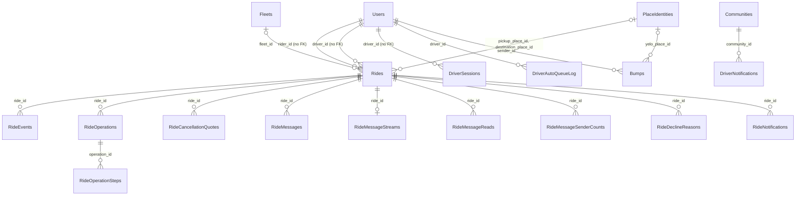

This page covers every table that stores a ride or something that happens during one. Payment columns on `Rides` are listed here and explained in [Payments tables](/reference/database/payments). For conventions used on this page, see [Database overview](/reference/database/overview).

## Ride status model

`Rides.status` is plain `text`. It started as the `RidesStatus` Postgres enum and was converted to text in `000033_change-ride-status-col-type`. The enum still exists but no column uses it. See [Enums](/reference/database/enums#ridesstatus).

The Go type `models.RideStatus` in `internal/models/ride.go` defines the values the code writes and reads:

| Status | Set by | Timestamp stamped |
| --- | --- | --- |
| `requested` | `CreateRequestedRide` when a rider asks for prices | `request_time` |
| `confirmed` | `ConfirmRequestedRide` when the rider picks a vehicle option and payment method. Also set again when a ride is un-queued or requeued. | `confirm_time`, `payment_consent_at` |
| `queued` | `AssignAcceptedRideToDriver` when the driver already has a ride, or when the assignment came from auto-queue | `match_time` |
| `driver_en_route` | `AssignAcceptedRideToDriver` when the driver is free, or `PromoteNextQueuedRide` and `PromoteAutoQueuedRide` | `match_time` (on accept only) |
| `driver_waiting` | `MarkRideAtPickup` | `at_pickup_time` |
| `in_progress` | `MarkRidePickedUp` after the confirm code check | `pickup_time` |
| `pending_rider_rating` | `CompleteRideForRating` when the driver completes the ride | `complete_time` |
| `complete` | `RateRideDriver`, `CompleteRideTip`, and every cancellation path | `complete_time` |
| `no_drivers_available` | No current writer. The code still reads the value for older rows. | None |

<Warning>
There is no `canceled` status. A cancelled ride has `status = 'complete'` and a non-null `cancel_phase`. Queries that count completed trips must filter on `cancel_phase IS NULL`, as `GetRideAcceptingDriver` and the contact-sync trigger do.
</Warning>

A direct offer to one driver doesn't change the status. `OfferDirectRide` sets `potential_driver` and `offer_time` on a `confirmed` ride. The offer blocks other matching for 30 seconds (`offer_time <= NOW() - INTERVAL '30 seconds'` in `ListUnmatchedRidesForActivation` and `CanAcceptDirectRide`).

## Rides

One row per ride request, from the first price quote to completion or cancellation. Created in `000001_init_db`. The row is the single source of truth for the ride's state, its assignment, and its payment references.

Writers: `internal/data/repository/ride*.go` through `queries/ride_lifecycle.sql`, `ride_matching.sql`, `ride_driver.sql`, `ride_command.sql`, and `ride_operation.sql`, called from `internal/service/ride` and `internal/service/activation`. Readers also include dashboard, analytics, earnings, contact sync, and messaging queries.

### Identity and participants

| Column | Type | Null | Default | Meaning |
| --- | --- | --- | --- | --- |
| `id` | `uuid` | No | `gen_random_uuid()` | Primary key. |
| `rider_id` | `uuid` | No | | Requesting user. No foreign key to `Users`. |
| `driver_id` | `uuid` | Yes | | Assigned driver. Set on accept, cleared on requeue or un-queue. No foreign key. |
| `potential_driver` | `uuid` | Yes | | Driver holding a direct offer. Cleared on accept, decline, or `ReleaseDirectRide`. |
| `declined_drivers` | `uuid[]` | No | | Drivers who declined or cancelled this ride. Matching skips them. `CreateRequestedRide` inserts an empty array. |
| `community_id` | `uuid` | No | Zero UUID | Community the ride was requested in. No foreign key. The zero-UUID default is a legacy sentinel; the create query always passes a value. |
| `fleet_id` | `uuid` | Yes | | Fleet whose price the rider selected at confirm, then the fleet of the accepting driver's session. FK to `Fleets` with `ON DELETE SET NULL`. |
| `driver_vehicle_id` | `uuid` | Yes | | Vehicle from the driver's open session at accept. No foreign key. |
| `driver_drive_count` | `integer` | Yes | | Snapshot of the driver's completed, non-cancelled ride count at accept, shown to the rider. |
| `auto_queued` | `boolean` | No | `false` | True when auto-queue assigned the ride rather than a manual accept. |

### Locations and route

| Column | Type | Null | Default | Meaning |
| --- | --- | --- | --- | --- |
| `pickup_name`, `pickup_address` | `text` | No | | Display name and street address of the pickup. |
| `pickup_latitude`, `pickup_longitude` | `real` | No | | Pickup coordinates. |
| `destination_name`, `destination_address` | `text` | No | | Display name and street address of the destination. |
| `destination_latitude`, `destination_longitude` | `real` | No | | Destination coordinates. |
| `pickup_mapbox_id`, `destination_mapbox_id` | `text` | Yes | | Provider place ID from the client's search result. The place trigger records it as a `legacy` provider alias. |
| `pickup_place_id`, `destination_place_id` | `uuid` | Yes | | Canonical place. Set by the `attach_yelo_pickup` and `attach_yelo_destination` triggers on every insert and on location changes. FK to `PlaceIdentities`. |
| `destination_categories` | `text[]` | No | `'{}'` | Place categories of the destination, used for the public feed and destination stats. |
| `destination_event_id` | `uuid` | Yes | | Event the rider is travelling to, when the destination came from an event. No foreign key. |
| `is_public_pickup`, `is_public_destination` | `boolean` | No | `false` | Whether the stop is a known public spot. Public-feed queries blank out non-public stops. |
| `distance` | `integer` | No | `0` | Trip distance in meters. |
| `duration` | `integer` | No | `0` | Trip duration in seconds. |
| `route` | `text` | No | `''` | Encoded trip route geometry from the routing provider. |
| `pickup_route`, `pickup_distance`, `pickup_duration` | `text`, `integer`, `integer` | Yes | | Driver-to-pickup route, meters, and seconds. Written on accept and by `UpdateRidePickupRoute`. |

### Lifecycle

| Column | Type | Null | Default | Meaning |
| --- | --- | --- | --- | --- |
| `status` | `text` | No | | See [Ride status model](#ride-status-model). No check constraint. |
| `request_time` | `timestamptz` | No | | When the ride was requested. |
| `confirm_time` | `timestamptz` | Yes | | When the rider confirmed. Reset to the requeue time when a driver cancels and the ride goes back to matching. |
| `payment_consent_at` | `timestamptz` | Yes | | Original confirm time. Kept across requeues and used as the Stripe mandate acceptance time. |
| `offer_time` | `timestamptz` | Yes | | When the current direct offer to `potential_driver` was made. |
| `match_time` | `timestamptz` | Yes | | When a driver accepted. Queue order is `COALESCE(match_time, request_time), id`. |
| `at_pickup_time` | `timestamp` (no time zone) | Yes | | When the driver reported arrival. The only lifecycle timestamp without a time zone. |
| `pickup_time` | `timestamptz` | Yes | | When the rider was picked up. |
| `complete_time` | `timestamptz` | Yes | | When the driver completed the ride, or when it was cancelled. |
| `confirm_code` | `integer` | Yes | `0` | Four-digit PIN (1000 to 9999) the driver must enter at pickup. `NULL` when the selected fleet has `requires_confirmation_code` off. `@rideyelo.com` accounts get `1234`. |
| `lifecycle_revision` | `bigint` | No | `0` | Incremented by `AdvanceRideCommandRevision` on every ride command. Check `>= 0`. |
| `assignment_generation` | `bigint` | No | `0` | Incremented when the active assignee changes. Check `>= 0`. |

### Cancellation and feedback

| Column | Type | Null | Default | Meaning |
| --- | --- | --- | --- | --- |
| `cancel_phase` | `text` | Yes | | Status the ride was in when cancelled. Non-null means cancelled. |
| `cancel_user` | `text` | Yes | | Who cancelled: `rider` or `driver` (`models.UserType`). `NULL` for automatic cancellation. |
| `cancel_reason` | `text` | Yes | | Reason. The system writes `automatic` for unmatched confirmed rides and `superseded` when a new request replaces an older `requested` ride. A driver's requeue reason is also stored here. |
| `cancel_comment` | `text` | Yes | | Free-text comment with the cancellation. |
| `driver_rating` | `integer` | Yes | | Rating the rider gave the driver (`RateRideDriver`). |
| `rider_rating` | `integer` | Yes | | Rating the driver gave the rider (`RateRideRider`). |
| `rider_feedback` | `text` | Yes | | Feedback written by the rider about the driver. |
| `driver_feedback` | `text` | Yes | | Feedback written by the driver about the rider. |
| `num_riders` | `integer` | Yes | | Passenger count reported by the driver when rating the rider. |

### Pricing and payment

These columns are explained in [Payments tables](/reference/database/payments#ride-payment-columns).

| Column | Type | Null | Default | Meaning |
| --- | --- | --- | --- | --- |
| `price` | `real` | No | | Fare in dollars. Set at request and overwritten at confirm with the selected option. |
| `vehicle_type` | `text` | No | `'x'` | Selected vehicle type key. Check: not empty. |
| `is_discounted`, `discounted_price`, `discount_id` | `boolean`, `real`, `uuid` | | `false` | Applied discount. Charged fare is `COALESCE(discounted_price, price)`. |
| `payment_method_id` | `text` | Yes | | Rider's Stripe payment method on the platform account. |
| `payment_method_brand` | `text` | Yes | | Card brand or wallet type shown in ride history. |
| `rider_ip_address`, `rider_user_agent` | `text` | Yes | | Captured at confirm for the Stripe mandate. |
| `payment_intent_id`, `payment_intent_client_secret` | `text` | Yes | | Stripe PaymentIntent on the connected account. |
| `payment_ephemeral_key` | `text` | No | `''` | Legacy Stripe ephemeral key. |
| `pre_auth_amount` | `numeric(10,2)` | Yes | | Amount authorized, in dollars. |
| `cloned_payment_method_id` | `text` | Yes | | Rider payment method cloned onto the connected account. |
| `stripe_merchant_id` | `text` | Yes | | Connected account that owns the PaymentIntent. |
| `driver_payout` | `real` | Yes | | Driver earnings for the ride in dollars, including tip or cancellation fee. |
| `tips_enabled`, `tip_amount`, `tip_window_expires_at`, `tip_payment_intent_id` | | | | Tip state. |
| `stripe_fee_cents`, `stripe_fee_repair_after` | `bigint`, `timestamptz` | Yes | | Stripe processing fee and the repair backoff. |

### Legacy columns

No current query reads or writes these by name. They remain from earlier versions of the ride flow.

| Column | Type | Null | Default |
| --- | --- | --- | --- |
| `latitude`, `longitude` | `numeric(9,6)` | Yes | |
| `x_price`, `xl_price`, `x_pickup_time`, `xl_pickup_time` | `real` | No | `0` |
| `discounted_x_price`, `discounted_xl_price` | `real` | Yes | |
| `destination_category` | `text` | No | `''` |

`time_remaining` (`integer`, nullable) is still selected by `GetRideDetailsProjection`, but nothing writes it.

### Keys, indexes, and triggers

- Primary key `id`. Foreign keys only on `fleet_id` (`ON DELETE SET NULL`), `pickup_place_id`, and `destination_place_id`.
- `idx_rides_rider_status (rider_id, status)`, `idx_rides_driver_status (driver_id, status)`, `idx_rides_community_status (community_id, status)`.
- Partial indexes for hot paths: `idx_rides_queued_driver` (queued rides with a driver), `idx_rides_unmatched_confirmed` (confirmed rides with no driver or offer), `idx_rides_potential_driver`, `idx_rides_complete_time`, `idx_rides_community_confirm_time`, `idx_rides_community_request_time_with_route`.
- `rides_rider_history_idx` and `rides_driver_history_idx` on `(user, request_time DESC)` where status is `complete` or `pending_rider_rating`.
- `rides_missing_fee_driver_idx` and `rides_missing_fee_payment_intent_idx` support the Stripe fee repair job.
- Trigger `attach_yelo_pickup` and `attach_yelo_destination` (`BEFORE INSERT OR UPDATE`) run `attach_yelo_place` to resolve `*_place_id`.
- Trigger `contact_sync_rides` (`AFTER INSERT OR UPDATE OR DELETE`) queues `ContactSyncRequests` for the rider and driver when a ride enters or leaves "completed and not cancelled".
- Row level security is enabled with no policies, so Supabase client roles can't read the table. The API connects as the owner.

### Concurrency

Ride commands lock the ride row (`LockRideCommandState ... FOR UPDATE`) and then every participant's `Users` row in a stable order. After a command, `AdvanceRideCommandRevision` bumps `lifecycle_revision` and, if the assignee changed, `assignment_generation`. `AdvanceUserRideStateRevision` bumps `Users.ride_state_revision` for each affected user so clients can detect stale ride state. See [Rides implementation](/engineering/api/rides-implementation).

Matching code also takes a Postgres advisory lock per ride (`AcquireRideAdvisoryLock` in `ride_driver.sql`).

### Gotchas

- `rider_id`, `driver_id`, `community_id`, `driver_vehicle_id`, `discount_id`, and `destination_event_id` have no foreign keys. Deleting a user or community leaves orphaned rides.
- Money is stored as `real` dollars in most columns, but `tip_amount` and `pre_auth_amount` are `numeric(10,2)` and `stripe_fee_cents` is integer cents. Payment code converts with `ROUND(... * 100)`.
- `DeleteAllRides` in `ride_lifecycle.sql` deletes every row. It exists for test and fixture tooling.

## RideEvents

Append-only timeline of what happened to a ride. Created in `000186_ride_events`. The dashboard ride detail view reads it.

| Column | Type | Null | Default | Meaning |
| --- | --- | --- | --- | --- |
| `id` | `bigint` | No | Identity | Primary key and tiebreaker for ordering. |
| `ride_id` | `uuid` | No | | FK to `Rides`. |
| `event_type` | `text` | No | | A `models.RideEventType` value from `internal/models/ride_event.go`, such as `ride_requested`, `ride_accepted`, `payment_intent_created`, `tip_captured`, or `message_sent`. |
| `actor_id` | `uuid` | Yes | | User who caused the event. No foreign key. |
| `actor_type` | `text` | Yes | | `rider`, `driver`, or `system`. |
| `old_status`, `new_status` | `text` | Yes | | Ride status before and after, for transition events. |
| `metadata` | `jsonb` | Yes | | Event-specific details. `message_sent` events store the message content and length. |
| `created_at` | `timestamptz` | No | `now()` | Insert time. |

Indexes: `(ride_id, created_at)` and `(event_type, created_at)`.

Writers: `rideevents.EventRecorder` in `internal/service/rideevents/recorder.go` buffers events in a 500-slot channel and inserts them from one goroutine. `InsertMessageTimeline` in `messaging.sql` writes `message_sent` events directly.

<Note>
Event recording is best effort. If the channel stays full for 100 ms, the event is dropped with a warning, and insert failures are only logged. Don't use `RideEvents` as an audit log of record.
</Note>

## RideOperations

Idempotent journal for ride commands that have money side effects. Created in `000339_ride_operation_journal`. Each row records one command's immutable decision so a River `ride_operation` job can retry provider calls without recomputing the decision.

<Warning>
The journal is not wired into production yet. `RideOperationJournal` in `internal/data/repository/ride_operation.go` says so, and nothing outside tests constructs it. The live ride flow still calls Stripe directly from `internal/service/ride`. Some live queries already respect the table, for example `MarkRidePaymentSucceeded` skips rides that have an operation.
</Warning>

| Column | Type | Null | Default | Meaning |
| --- | --- | --- | --- | --- |
| `id` | `uuid` | No | | Command ID supplied by the caller. A retry with the same ID must carry identical inputs. |
| `ride_id` | `uuid` | No | | FK to `Rides`. |
| `actor_id` | `uuid` | Yes | | FK to `Users`. Must be null exactly when `actor_type = 'system'`. |
| `actor_type` | `text` | No | | `rider`, `driver`, or `system`. |
| `kind` | `text` | No | | `accept`, `cancel`, `complete`, `promotion`, `settle_tip`, or `tip`. |
| `lifecycle_revision`, `assignment_generation` | `bigint` | No | | Ride revisions the decision was made against. Checks `>= 0`. |
| `inputs` | `jsonb` | No | | Server-built, versioned decision inputs. Must be an object. Never raw client JSON, card data, PINs, or client secrets. |
| `state` | `text` | No | `'pending'` | `pending`, `succeeded`, `failed`, or `quarantined`. |
| `outcome` | `jsonb` | Yes | | Final result object. Null exactly while `state = 'pending'`. |
| `created_at` | `timestamptz` | No | `clock_timestamp()` | Insert time. |
| `finished_at` | `timestamptz` | Yes | | Set with `outcome`. |

Constraints and triggers:

- `ride_operations_one_unresolved` is a unique partial index on `ride_id` where state is `pending` or `quarantined`. A ride can have only one unresolved operation.
- `protect_ride_operation_identity` (`BEFORE UPDATE`) rejects changes to any identity column, any change after `succeeded` or `failed`, and moving a `quarantined` row anywhere except `succeeded` or `failed`.
- `quarantined` means the operation finished while a step's provider outcome was still unknown. It keeps exclusive ownership of the ride until the step is reconciled.

`ClaimRideOperationsWithoutLiveJob` finds pending operations with no live `ride_operation` River job so a recovery worker can re-enqueue them.

## RideOperationSteps

One row per external call inside a `RideOperations` row. Created in `000339_ride_operation_journal`. The request is recorded and committed before calling Stripe, so retries reuse the same idempotency key (`RideOperationStepKey`).

| Column | Type | Null | Default | Meaning |
| --- | --- | --- | --- | --- |
| `operation_id` | `uuid` | No | | FK to `RideOperations`. Part of the primary key. |
| `name` | `text` | No | | Step name. Must match `^[a-z][a-z0-9_]{0,63}$`. Part of the primary key. |
| `request` | `jsonb` | No | | Exact provider request. Must be an object. |
| `first_attempt_at` | `timestamptz` | No | `clock_timestamp()` | Kept across retries so the Stripe idempotency window isn't silently restarted. |
| `result` | `jsonb` | Yes | | Verified provider outcome. Transport errors are not stored as results. |
| `resolved_at` | `timestamptz` | Yes | | Set with `result`. |

`protect_ride_operation_step` (`BEFORE UPDATE`) rejects changes to the request and any change once `result` is set.

## RideCancellationQuotes

Short-lived, immutable quote of a cancellation fee shown to the user before they confirm a cancellation. Created in `000340_ride_cancellation_quotes`. Part of the same unwired operation work as `RideOperations`; only the queries and e2e fixtures reference it.

| Column | Type | Null | Default | Meaning |
| --- | --- | --- | --- | --- |
| `id` | `uuid` | No | | Quote ID supplied by the caller. |
| `ride_id` | `uuid` | No | | FK to `Rides`. |
| `actor_id` | `uuid` | No | | User the quote was issued to. FK to `Users`. |
| `lifecycle_revision`, `assignment_generation` | `bigint` | No | | Ride revisions at quote time. A quote is only current while both still match the ride. |
| `inputs` | `jsonb` | No | | Fee inputs. Must be an object. |
| `created_at` | `timestamptz` | No | `clock_timestamp()` | Issue time. |
| `expires_at` | `timestamptz` | No | | `InsertRideCancellationQuote` sets 60 seconds. The check allows at most 2 minutes. |

Trigger `ride_cancellation_quote_immutable` rejects every update. Index on `expires_at` for cleanup.

## Ride messaging

Rider and driver chat for a ride uses four tables created in `000300_durable_ride_messaging`, plus `RideMessages`, which dates from `000180_clickhouse_deprecation`. Readers and writers: `queries/messaging.sql` through `internal/service/ride/messaging.go` and `messaging_sync.go`.

### RideMessages

| Column | Type | Null | Default | Meaning |
| --- | --- | --- | --- | --- |
| `id` | `uuid` | No | `gen_random_uuid()` | Primary key. |
| `ride_id` | `uuid` | No | | FK to `Rides`. |
| `sender_id` | `uuid` | No | | FK to `Users`. Must be the ride's rider or driver. |
| `content` | `text` | No | | Message body. |
| `created_at` | `timestamptz` | No | `now()` | Send time. |
| `message_index` | `bigint` | No | | Per-ride sequence number, starting at 1. Assigned by trigger; callers don't set it. |
| `client_message_id` | `uuid` | Yes | | Client-generated idempotency key. |

- `ride_messages_cursor` is unique on `(ride_id, message_index)` and includes `sender_id`. Clients page by index.
- `ride_messages_idempotency` is unique on `(ride_id, sender_id, client_message_id)` when the key is set. `FindMessageAttempt` returns the original row on retry.
- Trigger `ride_message_index` (`BEFORE INSERT`) runs `assign_ride_message_index`. It locks the ride, rejects senders who aren't the rider or driver with SQLSTATE `42501`, increments `RideMessageStreams`, and increments `RideMessageSenderCounts`.
- Trigger `ride_message_deleted` (`AFTER DELETE`) runs `remove_ride_message_counts` to decrement the counters.

### RideMessageStreams

One row per ride with messages.

| Column | Type | Null | Default | Meaning |
| --- | --- | --- | --- | --- |
| `ride_id` | `uuid` | No | | Primary key. FK to `Rides` with `ON DELETE CASCADE`. |
| `latest_index` | `bigint` | No | | Highest `message_index` issued. |
| `message_count` | `bigint` | No | | Messages in the ride. Check `>= 0`. |

### RideMessageSenderCounts

| Column | Type | Null | Default | Meaning |
| --- | --- | --- | --- | --- |
| `ride_id` | `uuid` | No | | Part of the primary key. FK to `Rides` with `ON DELETE CASCADE`. |
| `sender_id` | `uuid` | No | | Part of the primary key. FK to `Users` with `ON DELETE CASCADE`. |
| `message_count` | `bigint` | No | | Messages this user sent in the ride. Check `>= 0`. |

### RideMessageReads

Read cursor per participant.

| Column | Type | Null | Default | Meaning |
| --- | --- | --- | --- | --- |
| `ride_id` | `uuid` | No | | Part of the primary key. FK to `Rides` with `ON DELETE CASCADE`. |
| `user_id` | `uuid` | No | | Part of the primary key. FK to `Users` with `ON DELETE CASCADE`. |
| `message_index` | `bigint` | No | `0` | Highest index the user has read. Check `>= 0`. |
| `received_read_count` | `bigint` | No | `0` | How many messages from the other participant the user has read. Check `>= 0`. |

The function `advance_ride_message_read(ride, participant, through_index)` moves the cursor forward only, capped at `latest_index`, and adds the number of newly read messages from the other side. `AdvanceMessageRead` and `ImportMessageReadCursors` call it.

Unread count in `GetMessageInbox` is `message_count - own sent count - received_read_count`, floored at zero. This avoids scanning `RideMessages`.

### Messages (legacy)

Original chat table from `000029_add-messages-table`. Columns `id`, `ride_id`, `sender_id`, `content`, and `timestamp` (`timestamp` without time zone). No code references it. `RideMessages` replaced it.

## RideDeclineReasons

Why a driver declined a ride offer. Created in `000183_ride_decline_reasons`.

| Column | Type | Null | Default | Meaning |
| --- | --- | --- | --- | --- |
| `id` | `uuid` | No | `gen_random_uuid()` | Primary key. |
| `ride_id` | `uuid` | No | | FK to `Rides`. |
| `driver_id` | `uuid` | No | | FK to `Users`. |
| `reason` | `text` | No | | Reason the driver chose. |
| `created_at` | `timestamptz` | No | `now()` | Decline time. |

Unique on `(ride_id, driver_id)`. The decline transaction in `ride_driver.sql` locks the ride, appends to `Rides.declined_drivers`, clears `potential_driver` if it was this driver, and inserts the reason. Supply-and-demand and ride history queries read it.

## Issues and RideIssues

`Issues` stores problem reports from users. Created in `000075_issue-table`. `CreateIssue` in `engagement.sql` is the only writer, called from `internal/service/issue`.

| Column | Type | Null | Default | Meaning |
| --- | --- | --- | --- | --- |
| `id` | `uuid` | No | `gen_random_uuid()` | Row ID. Not declared as a primary key. |
| `ride_id` | `uuid` | Yes | | Ride the issue is about, if any. No foreign key. |
| `user_id` | `uuid` | No | | Reporter. No foreign key. |
| `issue_description` | `text` | No | | Category or description. |
| `issue_comment` | `text` | Yes | | Free-text details. |
| `timestamp` | `timestamptz` | No | `now()` | Report time. |

`RideIssues` (`000071_ride-issues`) has the same shape without `issue_comment`, with `ride_id` not null. No code references it.

<Warning>
Neither table has a primary key, a foreign key, or an index.
</Warning>

## Bumps

A "heading to X" intent that one user sends to a list of friends. Created in `000273_bumps`. Rows are short-lived: they show in recipients' friends layer and the community feed until `expires_at`. Writer: `persistBump` in `internal/service/notifications/bump.go`, after `NotifyFriendBump` checks that every recipient is a friend. Repository: `internal/data/repository/bump.go`, queries in `engagement.sql`.

| Column | Type | Null | Default | Meaning |
| --- | --- | --- | --- | --- |
| `id` | `uuid` | No | `gen_random_uuid()` | Primary key. |
| `sender_id` | `uuid` | No | | FK to `Users` with `ON DELETE CASCADE`. |
| `community_id` | `uuid` | Yes | | Sender's community. FK to `Communities`. |
| `destination_name` | `text` | No | | Destination label. Replaced by the location's name when it resolves to a public place. |
| `destination_poi_id` | `text` | Yes | | Location ID the client sent. |
| `destination_latitude`, `destination_longitude` | `double precision` | Yes | | Set only when the destination is a public location (`IsPublic` or `ShowOnMap`), so aggregates can't leak a private address. |
| `from_latitude`, `from_longitude` | `double precision` | Yes | | Sender's live position when they were online at send time. |
| `recipient_ids` | `uuid[]` | No | | Friends the bump was sent to. GIN-indexed for `= ANY(recipient_ids)` lookups. No foreign keys. |
| `idempotency_key` | `uuid` | No | | Client key. Unique; `CreateBump` uses `ON CONFLICT DO NOTHING`. |
| `created_at` | `timestamptz` | No | `now()` | |
| `expires_at` | `timestamptz` | No | | 3 hours after sending (`bumpExpiry`). |
| `mapbox_id`, `address`, `categories` | `text`, `text`, `text[]` | No | `''`, `''`, `'{}'` | Public location details, empty otherwise. |
| `yelo_place_id` | `uuid` | Yes | | Canonical place, set by the `attach_yelo_place` trigger. FK to `PlaceIdentities`. |

- A sender can send at most 20 bumps per hour (`bumpsPerHour`).
- `PurgeExpiredBumps` in `internal/service/maplayer/bump_retention.go` deletes rows 7 days after they expire, which also removes the sender's raw coordinates.
- Persistence is best effort. The push or SMS still goes out if the insert fails.

## DriverSessions

One row per driver online session. Created in `000109_driver-sessions`. For how sessions tie into fleet membership and vehicles, see [Fleets, vehicles, and driver supply](/reference/database/fleets-and-vehicles). A driver going online opens a session with the fleet and vehicle they're driving for. Going offline closes it.

| Column | Type | Null | Default | Meaning |
| --- | --- | --- | --- | --- |
| `driver_id` | `uuid` | No | | Driver. Part of the primary key. No foreign key to `Users`. |
| `start_time` | `timestamptz` | No | `now()` | Session start. Part of the primary key. |
| `end_time` | `timestamptz` | Yes | | Session end. `NULL` while open. |
| `fleet_id` | `uuid` | Yes | | Fleet for this session. FK to `Fleets` with `ON DELETE SET NULL`. |
| `vehicle_id` | `uuid` | Yes | | Vehicle for this session. FK to `Vehicles` with `ON DELETE SET NULL`. |

- `idx_driver_sessions_open` on `driver_id` where `end_time IS NULL`. It isn't unique, so the schema doesn't prevent two open sessions. `PromoteAutoQueuedRide` requires exactly one.
- Trigger `fleet_vehicle_session_guard` runs `guard_fleet_vehicle_session` on open sessions. When the fleet or vehicle is fleet-managed, it requires the vehicle to be approved (`application_status = 'complete'`) and available to the driver, and the driver to be an active member of the fleet. Otherwise it raises SQLSTATE `23514`.
- `CloseDriverSessionsWithoutActiveRides` only closes a session if the driver has no unfinished ride.

Writers: `user_driver.sql` and `fleet_vehicle.go`. Readers: ride acceptance, auto-queue promotion, supply and demand, notification recipient selection (`internal/notify/repository/recipients.go`).

## DriverAutoQueueLog

Intervals during which a driver had auto-queue turned on. Created in `000222_driver_auto_queue_log`. Used for auto-queue uptime metrics.

| Column | Type | Null | Default | Meaning |
| --- | --- | --- | --- | --- |
| `id` | `uuid` | No | `gen_random_uuid()` | Primary key. |
| `driver_id` | `uuid` | No | | FK to `Users` with `ON DELETE CASCADE`. |
| `enabled_at` | `timestamptz` | No | | Interval start. |
| `disabled_at` | `timestamptz` | Yes | | Interval end. `NULL` while open. |
| `community_id` | `uuid` | Yes | | Community at enable time. FK to `Communities` with `ON DELETE SET NULL`. |
| `created_timestamp` | `timestamptz` | No | `now()` | Insert time. |

`OpenDriverAutoQueueInterval` inserts only if the driver has no open interval, but no unique index enforces this. `ListDriverAutoQueueIntervalsForUptime` clips intervals to a session cap and the reporting window.

## RideNotifications

Dedupe log for push notifications sent about a ride. Created in `000180_clickhouse_deprecation`.

| Column | Type | Null | Default | Meaning |
| --- | --- | --- | --- | --- |
| `id` | `uuid` | No | `gen_random_uuid()` | Primary key. |
| `ride_id` | `uuid` | No | | FK to `Rides`. |
| `type` | `text` | No | | A `models.RideNotificationType`: `no_drivers_available`, `driver_matched`, `driver_arrived`, `completed`, `rider_canceled`, `driver_canceled`, or `ride_offered`. |
| `rider_id` | `uuid` | No | | FK to `Users`. |
| `driver_id` | `uuid` | No | | FK to `Users`. The sender of the update. |
| `community_id` | `uuid` | No | | FK to `Communities`. |
| `created_at` | `timestamptz` | No | `now()` | Send time. |

`internal/service/ride` checks `IsNotified(ride, type)` before sending and calls `AddNotification` afterwards. Rider updates are only recorded when the push succeeds. The rider-cancelled notice to the driver is recorded even if the push fails. The index on `(ride_id, type)` isn't unique, so concurrent sends can both record.

## DriverNotifications

Log of broadcast pushes to drivers in a community. Created in `000180_clickhouse_deprecation`.

| Column | Type | Null | Default | Meaning |
| --- | --- | --- | --- | --- |
| `id` | `uuid` | No | `gen_random_uuid()` | Primary key. |
| `community_id` | `uuid` | No | | FK to `Communities`. |
| `ride_id` | `uuid` | Yes | | Ride the broadcast was about, if any. No foreign key. |
| `type` | `text` | No | | A `models.DriverNotificationType`: `fare_increase`, `unclaimed_ride`, `unclaimed_ride_recent_only`, or `renew_online`. |
| `recipients` | `bigint` | No | `0` | Number of drivers targeted. |
| `created_at` | `timestamptz` | No | `now()` | Send time. |

The only current writer is the renew-online reminder in `internal/service/user/user.go`, which writes `renew_online` and reads the last one to space reminders. Queries in `community.sql` still read `unclaimed_ride` and `unclaimed_ride_recent_only` rows, but no current code writes them. Unclaimed-ride pushes now go through the notification pipeline. See [Notifications](/concepts/notifications).
