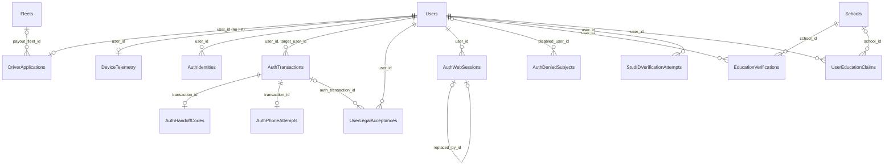

This page covers the account row and everything used to sign a user in or prove who they are. Payment identifiers on `Users` are explained in [Payments tables](/reference/database/payments#stripe-identifiers). For the sign-in flow itself, see [Authentication](/engineering/api/authentication).

`AuthRateLimitCounters`, `EmailOTPs`, `PhoneOTPs`, and `Waitlist` have no relationships.

## Users

One row per account, rider and driver alike. Created in `000001_init_db`. Both auth v2 (`CreateUserProfile` in `user_profile.go`) and auth v3 (`CreateAuthV3CompatibleUser` in `authv3.sql`) insert it, and both create the companion `DriverApplications` row at the same time.

Main writers: `queries/user_profile.sql`, `authv3.sql`, `user_driver.sql`, `education_commerce.sql`, `push_tokens.sql`, `fleet_join.sql`, plus raw SQL in `contact_sync.go`, `driver_leads.go`, and `fleet_vehicle.go`. Nearly every service reads it. `AuthCache` and `UserProfileCache` cache parts of it, so invalidate both after changing account fields. See [Data layer](/engineering/api/data-layer#caches).

### Profile

| Column | Type | Null | Default | Meaning |
| --- | --- | --- | --- | --- |
| `id` | `uuid` | No | `gen_random_uuid()` | Primary key. |
| `email` | `text` | No | | Email address. `''` means none. Unique only when not empty (`Users_email_key`). |
| `first_name`, `last_name` | `text` | No | `''` | Display name. |
| `phone_number` | `text` | No | `''` | Phone number. `''` means none. Indexed raw and by digits only. |
| `photo_url`, `photo_thumbnail_url` | `text` | No | `''` | Rider profile photo and thumbnail. |
| `gender` | `varchar(255)` | Yes | | `models.GenderOption`: `male`, `female`, `other`, `prefernottosay`. |
| `graduation_year` | `integer` | Yes | | Shown on public ride feed entries. |
| `created_timestamp` | `timestamptz` | No | `CURRENT_TIMESTAMP` | Sign-up time. |
| `is_terms_agreed` | `boolean` | No | `true` | Set to true again when auth v3 records legal acceptances. |
| `is_verified` | `boolean` | No | `false` | The user proved ownership of an email or phone. Auth v3 only matches verified users. Unverified rows can lose their email to a verified sign-in. |
| `profile_completed` | `boolean` | No | `false` | Onboarding finished. Set by `InitializeUserProfile` (auth v2) and `CompleteAuthV3UserProfile`. Analytics filter on it. |
| `account_type` | `text` | No | `'community'` | `student` or `community`. School verification sets `student`. Reconciliation sets `community` when no verification remains. |
| `acquisition_source` | `text` | Yes | | How the user arrived. See [Enums](/reference/database/enums#users-and-identity). Auth v2 writes `app_organic`. `SetAcquisitionSourceIfDefault` only upgrades from `app_organic`, to `app_referral`, `event_link`, or `qr_payment`. |
| `tags` | `text[]` | No | `'{}'` | Operator labels. `Founding Driver` (any case variant) gates Yelo-fleet direct offers. The dashboard adds `Fleet: ...` tags at read time through `dashboard_user_tags()`; they aren't stored. |
| `active_experiments` | `text[]` | No | `'{}'` | Experiment flags, replaced wholesale by `PUT /user/experiments`. |

### Community and school

| Column | Type | Null | Default | Meaning |
| --- | --- | --- | --- | --- |
| `community_id` | `uuid` | No | | Active community. Drives the feed and dispatch pool. Switchable, but not during an active ride. No foreign key. |
| `home_community_id` | `uuid` | No | Zero UUID | Community set at creation. Changes only through email community verification, the dashboard, archive reassignment, and `MoveUserToYeloCommunity`. `IsHomeCommunity` compares it with `community_id`. No foreign key. |
| `school_id` | `uuid` | Yes | | Verified school. No foreign key. Auth v3 writes `NULL` and auth v2 writes the zero UUID, so both mean "none". Reads normalize `NULL` to the zero UUID. |

### Driver state

| Column | Type | Null | Default | Meaning |
| --- | --- | --- | --- | --- |
| `is_online_driver` | `boolean` | No | `false` | Driver is online. `ExpireInactiveDrivers` turns it off after 30 minutes without a heartbeat. |
| `last_pinged_driver` | `timestamptz` | No | `CURRENT_TIMESTAMP` | Driver heartbeat. Auth v2 creation writes year 0001. |
| `latitude`, `longitude` | `numeric(9,6)` | Yes | | Last reported position. Written to Redis first, then asynchronously to Postgres. |
| `orientation` | `double precision` | Yes | `0` | Heading in degrees. |
| `speed` | `real` | Yes | `0` | Speed in meters per second. |
| `location_updated_at` | `timestamptz` | Yes | | Set with the position. |
| `share_location_with_friends` | `boolean` | No | `true` | Whether friends see this user's location. |
| `vehicle_id` | `uuid` | Yes | | Driver's selected vehicle. No foreign key. |
| `auto_queue` | `boolean` | No | `false` | Driver accepts auto-queued rides. |
| `auto_queue_max_minutes` | `integer` | Yes | | Driver's own cap on auto-queue pickup time. Overrides the community default in `internal/service/activation/auto_queue.go`. |
| `auto_queue_paused_until` | `timestamptz` | Yes | | Auto-queue is paused until this time. |
| `driver_profile_picture_url`, `driver_profile_picture_thumbnail_url` | `text` | No | `''` | Driver photo submitted for review. |
| `drivers_license_front_url`, `drivers_license_back_url` | `text` | No | `''` | License images submitted for review. |
| `ride_state_revision` | `bigint` | No | `0` | Counter bumped on every ride-state or presence change for this user. Clients use it to detect stale snapshots. Check `>= 0`. |
| `is_power_driver` | `boolean` | No | `false` | No code writes it. Only a debug matching-score endpoint reads it. |
| `lock` | `boolean` | No | `false` | Operator kill switch. No code writes it. Direct-offer and nearby-driver queries exclude locked users. |

### Account status and devices

| Column | Type | Null | Default | Meaning |
| --- | --- | --- | --- | --- |
| `is_banned` | `boolean` | No | `false` | Banned. Cached by `AuthCache` and checked by JWT middleware. |
| `is_test` | `boolean` | No | `false` | Test account. Excluded from analytics. |
| `is_deleted` | `boolean` | No | `false` | Soft delete flag. See [Soft delete](#soft-delete). |
| `deleted_at` | `timestamptz` | Yes | | When the account was deleted. |
| `auth_v3_provisional` | `boolean` | No | `false` | Auth v3 created this shell user from an OAuth identity before the phone step. Only provisional users can be merged or scrubbed by `ResolveProvisionalUser`. |
| `is_waitlisted` | `boolean` | No | `false` | Retired. Trigger `users_retire_waitlisting` forces it to `false` on every write. Kept for older clients. |
| `push_notification_token` | `text` | Yes | `''` | Canonical Expo push token. Unique when not empty. Setting it for one user clears it from any other. `''` is a legacy sentinel. |
| `allow_notifications` | `boolean` | No | `true` | User allows push notifications. |
| `sms_opted_out_at` | `timestamptz` | Yes | | Set when the user opts out of SMS, cleared on opt-in. |
| `app_version`, `expo_update_id` | `text`, `uuid` | | `''` | Mirrored from `DeviceTelemetry`. |

### Stripe, referral, and CRM

| Column | Type | Null | Default | Meaning |
| --- | --- | --- | --- | --- |
| `stripe_customer_id` | `text` | No | `''` | Rider's Stripe customer. |
| `stripe_merchant_id` | `text` | No | `''` | Driver's Stripe Express account. |
| `referral_code` | `text` | No | `''` | Current referral code. |
| `old_referral_code` | `text` | Yes | | Previous code, kept when creating a Dub link replaced it. Lookups match either column. |
| `has_dub_link` | `boolean` | No | `false` | A Dub short link exists for the referral code. |
| `quo_contact_id` | `text` | Yes | | OpenPhone (Quo) contact ID, written by contact sync. |
| `contacts_snapshot_hash` | `text` | No | `''` | SHA-256 of the user's last uploaded contact hash set. |
| `contacts_synced_at` | `timestamptz` | Yes | | Last contact upload. |
| `contacts_last_attempt` | `jsonb` | Yes | | Last contact-match attempt (`models.ContactMatchAttempt`). |
| `contacts_matched_at` | `timestamptz` | Yes | | Last successful contact match. |

### Keys, indexes, and triggers

- Primary key `id`. `Users_email_key` unique on `email` where not empty. `idx_users_push_notification_token_unique` unique on the token where not empty.
- Indexes on `community_id`, `school_id`, `phone_number`, digits of `phone_number`, `lower(btrim(email))`, `acquisition_source`, online drivers, SMS opt-outs, provisional users, and a World Cup signup index.
- `users_enqueue_quo_sync` queues a `QuoSyncRequests` row when name, email, phone, community, school, or `is_deleted` changes.
- `contact_sync_users` queues a `ContactSyncRequests` row when a CRM-relevant column changes. `contact_sync_activity` queues one at most every 5 minutes as the heartbeat or location moves.
- `users_link_driver_lead` links or merges `DriverLeads` rows by normalized phone number.
- `clear_recent_locations_on_user_deletion` deletes the user's `RecentLocations` when `is_deleted` becomes true.
- `users_retire_waitlisting` forces `is_waitlisted` to false.
- Row level security is enabled with no policies.

### Soft delete

`UserService.Delete` in `internal/service/user/user.go`:

1. Deletes the Stripe customer and the profile photo file.
2. Revokes Apple refresh tokens, deletes `AuthIdentities`, and runs `ScrubAuthV3User`.
3. Runs `ScrubUserPersonalDetails`.
4. Revokes all `AuthWebSessions`.

The scrub blanks names, email, phone, and all four photo URLs, and sets `is_deleted` and `deleted_at`. The row stays.

<Warning>
The scrub does not clear `drivers_license_front_url`, `drivers_license_back_url`, `push_notification_token`, location, Stripe IDs, `quo_contact_id`, referral codes, `gender`, `graduation_year`, `tags`, or the `contacts_*` columns. It also leaves `DeviceTelemetry`, `UserContacts`, `DriverApplications`, `EducationVerifications`, `UserEducationClaims`, and `UserLegalAcceptances` rows in place.
</Warning>

A hard `DELETE` of a `Users` row cascades to tables such as `AuthIdentities`, `AuthWebSessions`, `DeviceTelemetry`, and the ride message counters. It's blocked by rows in tables whose foreign key has no `ON DELETE` action, including `RideMessages`, `RideNotifications`, `RideDeclineReasons`, `RideOperations`, `TicketPurchases`, and `TextMessages`. `Rides`, `DriverApplications`, and `Issues` have no foreign key and are left orphaned.

## Auth v3 tables

Auth v3 (`internal/service/authv3`, `queries/authv3.sql`) keeps sign-in state in Postgres. Secrets are never stored raw: tokens and codes are SHA-256 hashes, and subjects used for rate limiting and denial are HMAC-SHA256 with keys from configuration.

Default lifetimes from `internal/utilities/config/authv3.go`, each overridable by environment variable:

| Setting | Default |
| --- | --- |
| Transaction | 10 minutes |
| Provider start | 5 minutes |
| Handoff code | 2 minutes |
| Onboarding token | 15 minutes |
| Web session idle | 90 days |
| Web session absolute | 365 days |

`RuntimeCleanupService` runs every 5 minutes. It deletes expired phone attempts and rate counters immediately, handoff codes 24 hours after expiry, and transactions 30 days after expiry if they have no handoff code.

### AuthTransactions

One sign-in or account-link attempt, modelled on OAuth PKCE. Created in `000256_auth_v3_storage`.

| Column | Type | Null | Default | Meaning |
| --- | --- | --- | --- | --- |
| `id` | `uuid` | No | `gen_random_uuid()` | Primary key. |
| `request_secret_hash` | `bytea` | No | | SHA-256 of the client's request secret. Unique. 32 bytes. |
| `purpose` | `text` | No | | `signin` or `link`. `link` requires `target_user_id`; `signin` forbids it. |
| `channel` | `text` | No | | `app` or `web`. |
| `client_id`, `redirect_uri` | `text` | No | | Client and where the handoff code is sent. |
| `state_hash`, `nonce_hash` | `bytea` | No | | SHA-256 of OAuth state and nonce. 32 bytes each. |
| `code_challenge` | `text` | No | | PKCE challenge. 43 characters. |
| `code_challenge_method` | `text` | No | `'S256'` | Only `S256` is allowed. |
| `target_user_id` | `uuid` | Yes | | User to link the identity to. FK to `Users` with `ON DELETE CASCADE`. |
| `user_id` | `uuid` | Yes | | Resolved user. Required once `verified` or `completed`. FK to `Users` with `ON DELETE CASCADE`. |
| `provider` | `text` | Yes | | `google`, `apple`, or `phone`. Required once `verified` or `completed`. |
| `status` | `text` | No | `'pending'` | See the lifecycle below. |
| `terms_version`, `privacy_version`, `accepted_at` | `text`, `text`, `timestamptz` | Yes | | Legal versions the user accepted. All null or all set. Must equal the configured versions. |
| `location_latitude`, `location_longitude`, `location_source` | `double precision`, `double precision`, `text` | Yes | | Coarse IP location used to pick a community. All null or all set, in range, with source `ip`. |
| `created_at` | `timestamptz` | No | `now()` | |
| `expires_at` | `timestamptz` | No | | Must be after `created_at`. |
| `completed_at` | `timestamptz` | Yes | | Required when `completed`. |
| `attempt_id` | `uuid` | Yes | | Client retry key. Unique per `client_id`. A retry rotates credentials only while the row is pending, unaccepted, and unexpired. |
| `native_phone_step` | `boolean` | No | `false` | The phone step runs natively in the app. |

Status transitions are compare-and-set on the expected status:

- `pending` to `provider_pending` (phone sign-in) or `verified` (provider identity resolved).
- `verified` to `completed` when the handoff code is consumed.
- `conflict` when the identity can't be linked, `expired` (set lazily on access; there is no sweeper), and `cancelled` (British spelling).

`AuthHandoffCodes`, `AuthPhoneAttempts`, `UserLegalAcceptances`, and `AttributionTouches` reference this table. The signup-channel analytics query joins it, so attribution for users older than the 30-day retention is lost.

### AuthIdentities

A verified login identity. Created in `000256_auth_v3_storage`.

| Column | Type | Null | Default | Meaning |
| --- | --- | --- | --- | --- |
| `id` | `uuid` | No | `gen_random_uuid()` | Primary key. |
| `user_id` | `uuid` | No | | FK to `Users` with `ON DELETE CASCADE`. |
| `provider` | `text` | No | | `google`, `apple`, or `phone`. |
| `provider_subject` | `text` | No | | Provider's stable subject. For `phone`, the E.164 number. Not blank. |
| `email`, `email_verified` | `text`, `boolean` | | `false` | Email from the provider and whether the provider verified it. |
| `phone_number`, `phone_verified` | `text`, `boolean` | | `false` | For `phone`, must be verified, E.164, and equal to `provider_subject`. |
| `provider_first_name`, `provider_last_name`, `provider_photo_url` | `text` | Yes | | Profile data from the provider, used to prefill onboarding. |
| `apple_refresh_token_ciphertext` | `bytea` | Yes | | Apple refresh token, AES-GCM encrypted with `AUTH_V3_REFRESH_TOKEN_KEYS`. Only allowed for `apple`. Revoked at account deletion. |
| `created_at`, `updated_at`, `last_authenticated_at` | `timestamptz` | No | `now()` | |

Unique on `(provider, provider_subject)` and `(user_id, provider)`, so a user has at most one identity per provider. Partial indexes on verified email and verified phone support candidate matching. Auth v2 also upserts Google and Apple identities on a best-effort basis (`UpsertAuthProviderIdentity`) and ignores unique violations.

### AuthHandoffCodes

Single-use code that moves a verified transaction to a token. Created in `000256_auth_v3_storage`.

| Column | Type | Null | Default | Meaning |
| --- | --- | --- | --- | --- |
| `id` | `uuid` | No | `gen_random_uuid()` | Primary key. |
| `transaction_id` | `uuid` | No | | FK to `AuthTransactions` with `ON DELETE CASCADE`. Unique, so one code per transaction. |
| `user_id` | `uuid` | No | | FK to `Users` with `ON DELETE CASCADE`. |
| `code_hash` | `bytea` | No | | SHA-256 of the 256-bit code. Unique. |
| `expires_at` | `timestamptz` | No | | The earlier of now plus the handoff TTL and the transaction's expiry. |
| `consumed_at` | `timestamptz` | Yes | | Set at `/token`. |
| `created_at` | `timestamptz` | No | `now()` | |

`ConsumeAuthV3HandoffCode` sets `consumed_at` and moves the transaction to `completed` in one statement, after verifying the PKCE `code_verifier`, `client_id`, and `redirect_uri`. The response is a user JWT, or an onboarding JWT if the profile isn't complete. The web channel also opens an `AuthWebSessions` row.

### AuthPhoneAttempts

The phone OTP step for one transaction. Created in `000257_auth_v3_runtime_state`. It serves both phone sign-in and the phone step after Google or Apple.

| Column | Type | Null | Default | Meaning |
| --- | --- | --- | --- | --- |
| `id` | `uuid` | No | `gen_random_uuid()` | Primary key. |
| `transaction_id` | `uuid` | No | | FK to `AuthTransactions` with `ON DELETE CASCADE`. Unique. |
| `phone_number` | `text` | No | | E.164 number. |
| `phone_hash`, `requester_hash` | `bytea` | No | | HMAC of the phone and of the requester's IP prefix (/24 for IPv4, /56 for IPv6). 32 bytes each. |
| `created_at`, `expires_at` | `timestamptz` | No | | Expiry is capped at 10 minutes. |
| `last_sent_at` | `timestamptz` | Yes | | Last send. Enforces a 30-second cooldown. |
| `verified_at` | `timestamptz` | Yes | | Code accepted. |
| `send_count`, `verify_count` | `integer` | No | `0` | At most 5 sends and 5 verify attempts. |
| `otp_code` | `text` | Yes | | Server-generated 5-digit code, stored in plain text until verified or the fallback sends it, then cleared. |
| `verification_sid` | `text` | Yes | | Twilio Verify verification SID. |
| `delivery_status`, `delivered_at` | `text`, `timestamptz` | Yes | | From the Twilio Event Streams webhook. |
| `fallback_sent_at` | `timestamptz` | Yes | | When the fallback SMS was claimed. |

The code is sent through Twilio Verify as a custom code. When `TWILIO_OTP_FALLBACK_ENABLED` is on, `PhoneFallbackService` claims attempts that are still undelivered and unverified after `TWILIO_OTP_FALLBACK_DELAY` (default 60 seconds), sends the same code through the legacy SMS sender, and clears `otp_code`. The partial index `auth_phone_attempts_fallback_sweep_idx` matches that claim.

### AuthWebSessions

Rotating refresh tokens for the web channel. Created in `000267_auth_v3_web_sessions`.

| Column | Type | Null | Default | Meaning |
| --- | --- | --- | --- | --- |
| `id` | `uuid` | No | `gen_random_uuid()` | Primary key. |
| `family_id` | `uuid` | No | | All rotations of one login share a family. |
| `user_id` | `uuid` | No | | FK to `Users` with `ON DELETE CASCADE`. |
| `token_hash` | `bytea` | No | | SHA-256 of the refresh token. Unique. |
| `created_at`, `last_used_at` | `timestamptz` | No | | |
| `idle_expires_at` | `timestamptz` | No | | 90 days after last use, capped at the absolute expiry. |
| `absolute_expires_at` | `timestamptz` | No | | 365 days after the family started. Carried to every rotation. |
| `rotated_at`, `replaced_by_id` | `timestamptz`, `uuid` | Yes | | Set together when the token is rotated. `replaced_by_id` is a self FK with `ON DELETE SET NULL`. |
| `revoked_at` | `timestamptz` | Yes | | Revoked. |

Presenting a rotated or revoked token is treated as replay and revokes the whole family. Logout and account deletion also revoke. No job deletes expired rows.

### AuthDeniedSubjects

Provider subjects that must not sign in, for example the Google account of a deleted or banned user. Created in `000257_auth_v3_runtime_state`.

| Column | Type | Null | Default | Meaning |
| --- | --- | --- | --- | --- |
| `id` | `uuid` | No | `gen_random_uuid()` | Primary key. |
| `provider` | `text` | No | | `google`, `apple`, or `phone`. |
| `subject_hash` | `bytea` | No | | HMAC-SHA256 with `AUTH_V3_SUBJECT_HMAC_KEY` over a `denied-subject:` prefix, the provider, and the subject. 32 bytes. Unique with `provider`. |
| `disabled_user_id` | `uuid` | Yes | | User the subject belonged to. FK to `Users` with `ON DELETE SET NULL`. |
| `reason` | `text` | Yes | | `disabled_user`, `deleted_user`, or `banned_user`. `ambiguous_match` and `provider_slot_occupied` are allowed but no longer written. |
| `created_at` | `timestamptz` | No | `now()` | |

The resolver writes a row when a matched user is missing, deleted, or banned, and never overwrites an existing reason. Account deletion itself does not write here. Rotating the HMAC key requires a data migration.

### AuthRateLimitCounters

Fixed-window counters for auth rate limits. Created in `000257_auth_v3_runtime_state`.

| Column | Type | Null | Default | Meaning |
| --- | --- | --- | --- | --- |
| `scope` | `text` | No | | Limit name. Must match `^[a-z][a-z0-9_]{0,63}$`. Part of the primary key. |
| `subject_hash` | `bytea` | No | | HMAC of the subject with `AUTH_V3_RATE_LIMIT_HMAC_KEY`. Part of the primary key. |
| `count` | `integer` | No | | Hits in the window. Check `> 0`. |
| `window_started_at` | `timestamptz` | No | | First hit of the window. |
| `expires_at` | `timestamptz` | No | | End of the window. |
| `updated_at` | `timestamptz` | No | | |

Scopes in use:

| Scope | Window and limit | Subject |
| --- | --- | --- |
| `http_configuration` | 10 minutes, 120 | IP prefix |
| `http_authorize` | 10 minutes, 30 | IP prefix |
| `http_accept` | 10 minutes, 60 | IP prefix |
| `http_provider_start` | 10 minutes, 60 | IP prefix |
| `http_provider_callback` | 10 minutes, 120 | IP prefix |
| `http_token` | 10 minutes, 60 | IP prefix |
| `http_phone_send` | 1 hour, 120 | IP prefix |
| `http_phone_verify` | 1 hour, 240 | IP prefix |
| `http_legacy_phone_send` | 1 hour, 20 | Requester, for the auth v2 SMS endpoint |
| `http_legacy_phone_send_global` | 1 hour, 60 | A fixed sentinel subject |
| `phone_send_phone` | 1 hour, 10 | Phone |
| `phone_send_requester` | 1 hour, 20 | Requester |
| `phone_verify_phone` | 1 hour, 20 | Phone |
| `phone_verify_requester` | 1 hour, 40 | Requester |

With e2e control enabled, HTTP limits are multiplied by 100.

## UserLegalAcceptances

Which Terms and Privacy versions a user accepted. Created in `000256_auth_v3_storage`. Only auth v3 writes it.

| Column | Type | Null | Default | Meaning |
| --- | --- | --- | --- | --- |
| `id` | `uuid` | No | `gen_random_uuid()` | Primary key. |
| `user_id` | `uuid` | No | | FK to `Users` with `ON DELETE CASCADE`. |
| `document` | `text` | No | | `terms` or `privacy`. |
| `version` | `text` | No | | Opaque version string from `AUTH_V3_TERMS_VERSION` or `AUTH_V3_PRIVACY_VERSION`. Not blank. |
| `accepted_at` | `timestamptz` | No | | From the transaction. |
| `auth_transaction_id` | `uuid` | Yes | | Transaction the acceptance came from. FK with `ON DELETE SET NULL`, so it outlives transaction cleanup. |
| `created_at` | `timestamptz` | No | `now()` | |

Unique on `(user_id, document, version)`. `RecordAuthV3TransactionLegalAcceptances` inserts both documents with `ON CONFLICT DO NOTHING` and sets `Users.is_terms_agreed`. `ValidateAuthV3ProfileLegalAcceptance` gates profile completion.

## Education tables

### EducationVerifications

Proof that a user belongs to a school, one row per provider. Created in `000280_auth_v3_education_verifications`. The newest remaining verification decides `Users.school_id` and `account_type` through `ReconcileUserEducationVerification`.

| Column | Type | Null | Default | Meaning |
| --- | --- | --- | --- | --- |
| `id` | `uuid` | No | `gen_random_uuid()` | Primary key. |
| `user_id` | `uuid` | No | | FK to `Users` with `ON DELETE CASCADE`. |
| `provider` | `text` | No | | `studid`, `google`, `microsoft`, or `email_otp`. |
| `provider_subject`, `provider_subject_type` | `text` | Yes | | Provider's subject. Unique per provider when not blank. |
| `institution_entity_id` | `text` | Yes | | StudID institution ID. Required for `studid`. |
| `affiliations` | `text[]` | No | `'{}'` | Affiliations returned by the provider. |
| `email` | `text` | Yes | | Verified school email. |
| `school_id` | `uuid` | No | | FK to `Schools`. |
| `verified_at`, `updated_at` | `timestamptz` | No | `now()` | |

Unique on `(user_id, provider)`. Writers: `UpsertEducationVerification`, `UpsertStudIDEducationVerification`, and `CompleteSchoolVerification` in `education_verification.go`. The StudID upsert doesn't refresh `email` on conflict.

### StudIDVerificationAttempts

A pending StudID verification. Created in `000280_auth_v3_education_verifications`.

| Column | Type | Null | Default | Meaning |
| --- | --- | --- | --- | --- |
| `verification_id` | `uuid` | No | | Primary key. StudID's verification ID. |
| `user_id` | `uuid` | No | | FK to `Users` with `ON DELETE CASCADE`. |
| `secret_token_ciphertext` | `bytea` | No | | StudID secret, AES-GCM encrypted with the same keyring as Apple refresh tokens. |
| `expires_at` | `timestamptz` | No | | 60 minutes after creation. |
| `consumed_at` | `timestamptz` | Yes | | Set when the callback consumes the attempt. |
| `created_at` | `timestamptz` | No | `now()` | |

No job deletes expired rows.

### UserEducationClaims

A `.edu` email a user entered for the World Cup campaign. Leaderboard standings count these rows. Created in `000235_world_cup_education_claims`. Service: `internal/service/worldcup`.

| Column | Type | Null | Default | Meaning |
| --- | --- | --- | --- | --- |
| `id` | `uuid` | No | `gen_random_uuid()` | Primary key. |
| `user_id` | `uuid` | No | | FK to `Users` with `ON DELETE CASCADE`. |
| `campaign_key` | `text` | No | | Only `world_cup` is allowed. |
| `email`, `domain` | `text` | No | | Claimed email and its domain. |
| `school_id` | `uuid` | Yes | | School matched from the domain. `NULL` means unmatched; the dashboard can rematch a domain. |
| `status` | `text` | No | `'pending'` | `pending`, `verified` after email verification, or `superseded` by a newer claim. |
| `source_intent` | `text` | No | `'edu_capture'` | Always `edu_capture` today. |
| `claimed_at`, `verified_at`, `prompt_dismissed_at`, `updated_at` | `timestamptz` | | | Lifecycle times. `prompt_dismissed_at` hides the capture prompt. |

Partial unique indexes allow one current (`pending` or `verified`) claim per user per campaign, and one per email per campaign.

## DriverApplications

Driver onboarding state, one row per user. For payout fleets and vehicle approval, see [Fleets, vehicles, and driver supply](/reference/database/fleets-and-vehicles). Created in `000116_driver_application` and created alongside every user; `000254` backfilled missing rows.

| Column | Type | Null | Default | Meaning |
| --- | --- | --- | --- | --- |
| `user_id` | `uuid` | No | | Primary key. No foreign key to `Users`, so it doesn't cascade. |
| `profile_picture_status` | `text` | No | `'not_applied'` | `not_applied`, `pending` after upload, then `complete` or `failed` after dashboard review. |
| `profile_picture_submission_time`, `profile_picture_reviewer`, `profile_picture_review_time`, `profile_picture_rejection_reason` | | Yes | | Submission and review details. Reviewer has no foreign key. |
| `license_status` | `text` | No | `'not_applied'` | Same values and flow as the profile picture. |
| `license_submission_time`, `license_reviewer`, `license_review_time`, `license_rejection_reason` | | Yes | | Submission and review details. |
| `stripe_status` | `text` | No | `'not_applied'` | Derived from the driver's Stripe account: `restricted` if requirements are past due or currently due, `pending` if payouts are disabled, otherwise `complete`. The dashboard can also set `complete` or `failed`. |
| `stripe_review_time` | `timestamptz` | Yes | | Exposed to clients as the Stripe step's submission time. |
| `is_active` | `boolean` | No | `false` | Driver is approved to drive. `ActivateEligibleDriver` sets it once photo, license, payout, and a completed vehicle are ready. No code sets it back to false. |
| `activated_at` | `timestamptz` | Yes | | First activation time. |
| `is_action_required` | `boolean` | No | `false` | An admin needs to review something: license, photo, or a vehicle is `pending`. Recomputed by `RefreshDriverApplicationActionRequired`. |
| `payout_fleet_id` | `uuid` | Yes | | Fleet that pays this driver. When set, the fleet's payout readiness replaces the driver's own `stripe_status`. FK to `Fleets` with `ON DELETE SET NULL`. |
| `payout_fleet_joined_at` | `timestamptz` | Yes | | When the driver joined the payout fleet by code or admin action. |

Status values are `models.ApplicationStatus` with no database check. See [Enums](/reference/database/enums#driverapplicationstatus).

Triggers: `guard_fleet_payout_archive`, which rejects a `payout_fleet_id` that points at an archived fleet (see [Fleet archival](/reference/database/fleets-and-vehicles#fleet-archival)), `driver_applications_enqueue_quo_sync`, `contact_sync_drivers`, and `driver_applications_create_lead`, which upserts a `DriverLeads` row with source `driver_app` once the user shows any driver activity. See [Driver onboarding](/concepts/driver-onboarding).

## DeviceTelemetry

Latest device, app, and permission snapshot per user, sent by the app to the telemetry endpoint. Created in `000179_device-telemetry`. Written by `UpsertDeviceTelemetryWithoutPushToken` through `internal/service/telemetry`.

| Column | Type | Null | Default | Meaning |
| --- | --- | --- | --- | --- |
| `user_id` | `uuid` | No | | Primary key. FK to `Users` with `ON DELETE CASCADE`. |
| `platform`, `os_version`, `device_model`, `device_manufacturer` | `text` | No | | Device details. |
| `app_version`, `build_number` | `text` | No | | App build. `app_version` is mirrored to `Users`. |
| `expo_update_id` | `text` | Yes | | OTA update ID. Mirrored to `Users.expo_update_id` (a `uuid`) only when it parses as a UUID. |
| `screen_width`, `screen_height`, `pixel_ratio` | `integer`, `integer`, `real` | No | `0`, `0`, `1.0` | Screen metrics. |
| `locale`, `timezone` | `text` | No | `'en-US'`, `'UTC'` | Device locale and time zone. |
| `notifications_enabled` | `boolean` | No | `false` | OS notification permission. |
| `location_permission` | `text` | No | `'undetermined'` | OS location permission. |
| `contact_permission`, `contact_access_privileges`, `contact_permission_updated_at` | `text`, `text`, `timestamptz` | | `'undetermined'`, `''` | Contacts permission. An empty value keeps the previous one. |
| `push_notification_token` | `text` | Yes | | Deprecated shadow of the push token. Current code only clears it; tokens go to `Users`. |
| `carrier`, `total_memory_mb`, `install_referrer` | | Yes | | Optional device details. |
| `updated_at` | `timestamptz` | No | `now()` | Last upload. |

Triggers: `sync_legacy_telemetry_push_token` copies a non-empty token here onto `Users` and clears it from other users. `contact_sync_telemetry` queues contact activity at most once per 5-minute bucket.

## Retired tables

No current code reads or writes these tables.

| Table | Created | Columns | Notes |
| --- | --- | --- | --- |
| `EmailOTPs` | `000001_init_db` | `id`, `email` (unique), `otp`, `created_at`, `request_count`, `transfer_school_id`, `user_id` | The repository is constructed but no service calls it. Auth v2 keeps OTPs in Redis. RLS is enabled. |
| `PhoneOTPs` | `000001_init_db` | `id`, `phone_number`, `otp`, `created_at` (`timestamp` without time zone), `request_count`, `user_id` | Same as `EmailOTPs`. No index on `phone_number`. |
| `Waitlist` | `000005_add_waitlist_table` | `id`, `school`, `created_at` (`timestamp(3)` without time zone), `name`, `phone_number` | Only in generated code. |

## Gotchas

- `Users.community_id`, `home_community_id`, `school_id`, and `vehicle_id` have no foreign keys, and `DriverApplications.user_id` has none either.
- `school_id` uses both `NULL` and the zero UUID to mean "no school".
- `VerifyUserEmail` in `user_profile.sql` updates by email, not by ID. `Users_email_key` (partial since `000114_email-uniqueness`) keeps non-empty emails unique, so it touches one row unless it's called with `''`.
- `LockFleetJoinUser` in `fleet_join.sql` selects `u.lock AS is_banned`, so the fleet join ban check reads `lock`, which nothing sets, instead of `is_banned`.
- `AuthWebSessions` and `StudIDVerificationAttempts` grow without cleanup.
